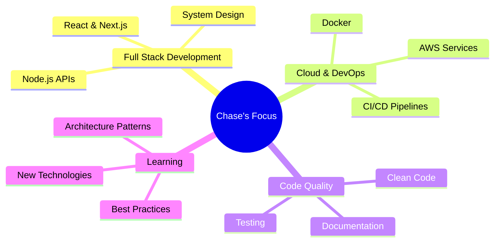

<div align="center">
  
# 👋 Hey there, I'm Chase Elkins

[](https://git.io/typing-svg)


</div>

---


## 💫 About Me

```typescript
const chase = {
    pronouns: "he/him",
    code: ["JavaScript", "TypeScript", "Java", "Python", "Swift"],
    askMeAbout: ["web dev", "tech", "app dev", "system design"],
    technologies: {
        frontEnd: {
            js: ["React", "Next.js"],
            css: ["Tailwind", "Bootstrap", "Material UI"],
            uiLibraries: ["shadcn/ui", "Radix UI"]
        },
        backEnd: {
            js: ["Node.js", "Express"],
            java: ["Spring Boot"],
            python: ["FastAPI"]
        },
        databases: ["PostgreSQL", "MongoDB", "MySQL", "Redis"],
        devOps: ["Docker", "AWS", "CI/CD", "GitHub Actions"],
        tools: ["Git", "Postman", "VS Code", "Jira"]
    },
    architecture: ["Microservices", "REST APIs", "GraphQL", "Event-Driven"],
    currentFocus: "Building scalable full-stack applications",
    funFact: "I debug with console.log and I'm not ashamed"
};
```


---

## 🛠️ Tech Stack & Tools

<div align="center">

### 💻 Frontend Development


### ⚙️ Backend Development


### 🗄️ Databases


### ☁️ DevOps & Cloud


### 📱 Mobile & Other


</div>


---

## 📊 GitHub Analytics

<div align="center">
  
  
</div>

<div align="center">
  
</div>

<div align="center">
  
</div>


---

## 🏆 GitHub Trophies

<div align="center">
  
</div>

---

## 📈 Contribution Graph

<div align="center">
  
</div>

---

## 🔥 Contribution Streak & Activity

<div align="center">
  


</div>

<div align="center">
  
</div>

---

## 💭 Dev Quote of the Day

<div align="center">

[](https://github.com/piyushsuthar/github-readme-quotes)

</div>

---

## 🎯 Current Focus

<div align="center">



</div>

---

## 📫 Connect With Me

<div align="center">

[](https://www.linkedin.com/in/chase-elkins-793bb8169/)
[](https://c-elkins.github.io/chase-elkins-portfolio/)
[](mailto:Chase.e.elkins1@gmail.com)
[](https://x.com/ChaseElk_)

</div>

<div align="center">
  
### 💬 Let's Build Something Amazing Together!

*I'm always open to interesting projects, collaborations, and opportunities to create impactful solutions.*

</div>

---

<div align="center">

### 🔥 Profile Stats


</div>

---

<div align="center">
  


### ⚡ *"Code is like humor. When you have to explain it, it's bad."* – Cory House


**Thanks for stopping by! Happy Coding! ✨**


</div>
